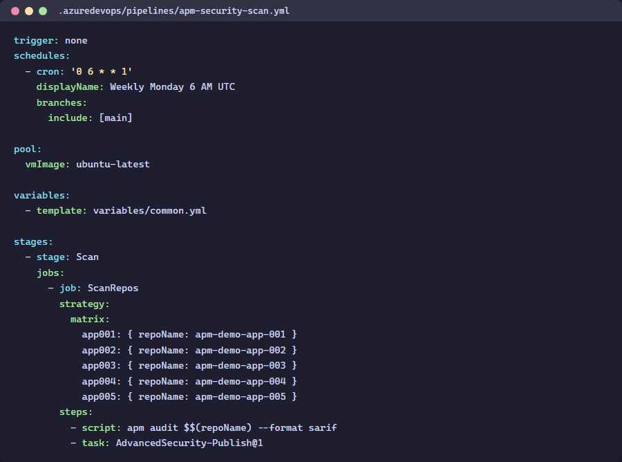

> 🇬🇧 **[English version]({{ '/labs/lab-07-ado-pipelines/' | relative_url }})**

# Labo 07 ADO : Pipelines YAML — Pipeline multi-moteur

| Durée | Niveau | Prérequis |
|-------|--------|-----------|
| 50 min | Avancé | Labo 06 ADO |

## Objectifs d'apprentissage

- Créer des pipelines YAML ADO pour l'analyse de sécurité APM

## Point de vérification

- [ ] Le pipeline d'analyse ADO exécute les 3 étapes
- [ ] Les résultats SARIF apparaissent dans Advanced Security

## Étapes suivantes

Passez au [Labo 08 : Tableau de bord Power BI](../lab-08-dashboard).
