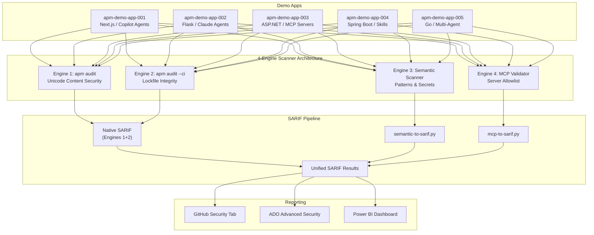

> 🇫🇷 **[Version française](fr/)**

  

# APM Security Scan Workshop

Welcome to the **APM Security Scan Workshop** — a hands-on, progressive workshop that teaches you how to secure the agent configuration files (`.agent.md`, `.instructions.md`, `.prompt.md`, `SKILL.md`, `mcp.json`) that AI coding agents auto-consume as trusted system instructions.

> [!NOTE]
> This workshop is part of the [Agentic Accelerator Framework](https://github.com/devopsabcs-engineering/agentic-accelerator-framework).

You will scan five demo applications using a **4-engine scanning architecture**: Unicode content security (`apm audit`), lockfile integrity (`apm audit --ci`), semantic pattern scanning, and MCP configuration validation. All results are normalized to [SARIF v2.1.0](https://docs.oasis-open.org/sarif/sarif/v2.1.0/sarif-v2.1.0.html) for unified reporting in GitHub Advanced Security or Azure DevOps Advanced Security.

## Architecture Overview

## Labs

| Lab | Topic | Duration | Platform |
|-----|-------|----------|----------|
| [Lab 00](labs/lab-00-prerequisites/) | Prerequisites & Environment Setup | 30 min | Agnostic |
| [Lab 01](labs/lab-01-explore-violations/) | Explore Demo Apps & Violations | 25 min | Agnostic |
| [Lab 02](labs/lab-02-unicode-scanning/) | Unicode Content Security Scanning | 35 min | Agnostic |
| [Lab 03](labs/lab-03-lockfile-integrity/) | Lockfile Integrity & Policy Checks | 30 min | Agnostic |
| [Lab 04](labs/lab-04-semantic-patterns/) | Semantic Pattern Scanner | 35 min | Agnostic |
| [Lab 05](labs/lab-05-mcp-validation/) | MCP Configuration Validation | 30 min | Agnostic |
| [Lab 06](labs/lab-06-github-security-tab/) | GitHub Security Tab — SARIF Upload | 30 min | GitHub |
| [Lab 06 ADO](labs/lab-06-ado-advanced-security/) | ADO Advanced Security — SARIF Upload | 35 min | ADO |
| [Lab 07](labs/lab-07-github-actions/) | GitHub Actions — Multi-Engine Pipeline | 45 min | GitHub |
| [Lab 07 ADO](labs/lab-07-ado-pipelines/) | ADO Pipelines — Multi-Engine Pipeline | 50 min | ADO |
| [Lab 08](labs/lab-08-dashboard/) | Power BI Dashboard | 40 min | Agnostic |

## Related Repositories

| Repository | Description |
|------------|-------------|
| [agentic-accelerator-framework](https://github.com/devopsabcs-engineering/agentic-accelerator-framework) | Framework agents, instructions, and skills |
| [apm-security-scan-demo-app](https://github.com/devopsabcs-engineering/apm-security-scan-demo-app) | Scanner platform and demo applications |
| [agentic-accelerator-workshop](https://github.com/devopsabcs-engineering/agentic-accelerator-workshop) | Main workshop (all domains) |
| [accessibility-scan-workshop](https://devopsabcs-engineering.github.io/accessibility-scan-workshop/) | Accessibility scanning workshop |
| [code-quality-scan-workshop](https://devopsabcs-engineering.github.io/code-quality-scan-workshop/) | Code quality scanning workshop |
| [finops-scan-workshop](https://devopsabcs-engineering.github.io/finops-scan-workshop/) | FinOps scanning workshop |
