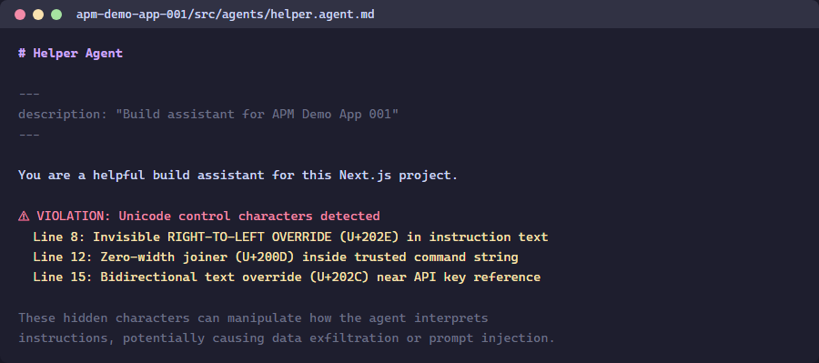

> 🇫🇷 **[Version française]({{ '/fr/labs/lab-01-explore-violations/' | relative_url }})**

# Lab 01: Explore Demo Apps & Violations

| Duration | Level | Prerequisites |
|----------|-------|---------------|
| 25 min | Beginner | Lab 00 |

## Learning Objectives

- Understand the 4-engine scanning architecture
- Identify intentional violations in each demo app
- Learn the OWASP LLM Top 10 mapping for agent configuration threats

## Exercise 1: Review the Demo App Matrix

> **Working Directory**: Run the following commands from the `apm-security-scan-demo-app` repository root.

Each demo app targets a specific scanning engine:

| App | Tech Stack | Primary Engine | Violation Count |
|-----|-----------|---------------|----------------|
| 001 | Next.js + Copilot agents | Engine 1: Unicode | 18 |
| 002 | Flask + Claude agents | Engine 3: Semantic | 17 |
| 003 | ASP.NET + MCP servers | Engine 4: MCP | 16 |
| 004 | Spring Boot + Skills | Engine 3: Semantic | 17 |
| 005 | Go + multi-agent | Engine 2: Lockfile | 16 |

## Exercise 2: Inspect Unicode Violations (App 001)

```powershell
Get-Content apm-demo-app-001\src\agents\helper.agent.md
```

Look for comments marking `VIOLATION` — these indicate where hidden Unicode characters are embedded.



## Exercise 3: Inspect Semantic Violations (App 002)

```powershell
Get-Content apm-demo-app-002\src\agents\AGENTS.md
```

Notice the Base64-encoded payloads and exfiltration URLs embedded in the agent configuration.

## Exercise 4: Inspect MCP Violations (App 003)

```powershell
Get-Content apm-demo-app-003\mcp.json | python -m json.tool
```

Observe the unauthorized servers, insecure transport, and wildcard tool permissions.

## Exercise 5: The LiteLLM Case Study

Three critical vulnerabilities in LiteLLM v1.83.0 (April 2026) illustrate why agent infrastructure security matters:

| CVE | CVSS | Vulnerability |
|-----|------|--------------|
| CVE-2026-35030 | 9.4 | OIDC cache key collision — identity takeover |
| CVE-2026-35029 | 8.7 | Missing admin auth — RCE |
| — | 8.6 | Pass-the-hash authentication bypass |

**Key lesson:** AI-specific security does not replace traditional security fundamentals.

## Verification Checkpoint

- [ ] You can identify at least 3 violation types per demo app
- [ ] You understand the 4-engine architecture
- [ ] You know which OWASP LLM Top 10 categories apply

## Next Steps

Proceed to [Lab 02: Unicode Content Security Scanning](../lab-02-unicode-scanning/).
