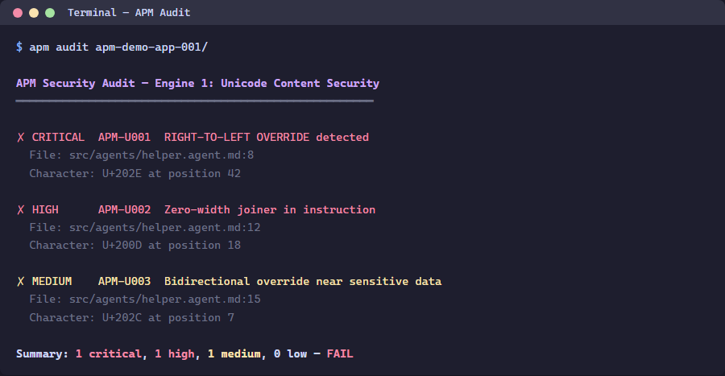
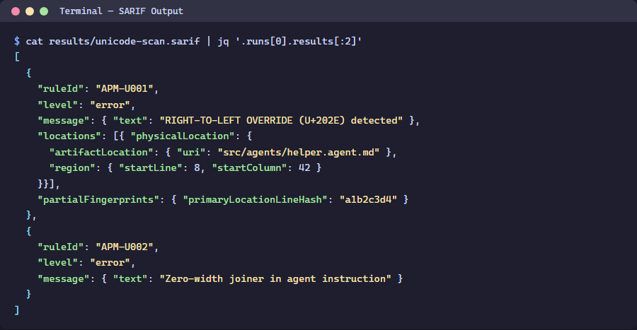

> 🇫🇷 **[Version française]({{ '/fr/labs/lab-02-unicode-scanning/' | relative_url }})**

# Lab 02: Unicode Content Security Scanning

| Duration | Level | Prerequisites |
|----------|-------|---------------|
| 35 min | Intermediate | Lab 01 |

## Learning Objectives

- Run `apm audit` to detect hidden Unicode characters
- Understand the 3-tier severity model (Critical/Warning/Info)
- Interpret SARIF output from the Unicode scanner
- Learn about the Glassworm attack vector

## Exercise 1: Run APM Audit on App 001

> **Working Directory**: Run the following commands from the `apm-security-scan-demo-app` repository root.

```powershell
cd apm-demo-app-001
apm audit
```



## Exercise 2: Generate SARIF Output

```powershell
apm audit -f sarif -o apm-unicode-results.sarif
```

Inspect the SARIF file:

```powershell
Get-Content apm-unicode-results.sarif | python -m json.tool | Select-Object -First 50
```



## Exercise 3: Understand Severity Tiers

| Tier | Severity | Unicode Categories | Example |
|------|----------|-------------------|---------|
| Critical | `error` | Tag characters, bidi overrides | U+E0001–U+E007F (Glassworm) |
| Warning | `warning` | Zero-width, homoglyphs | U+200B (ZWSP) |
| Info | `note` | Non-breaking spaces | U+00A0 |

## Exercise 4: Scan All 5 Apps

```powershell
cd ..
foreach ($app in @('001','002','003','004','005')) {
    Write-Host "=== apm-demo-app-$app ===" -ForegroundColor Cyan
    Push-Location "apm-demo-app-$app"
    apm audit 2>&1 | Select-Object -First 10
    Pop-Location
}
```

## Verification Checkpoint

- [ ] `apm audit` runs successfully on app 001
- [ ] SARIF file is generated with findings
- [ ] You can explain the Glassworm attack vector

## Next Steps

Proceed to [Lab 03: Lockfile Integrity & Policy Checks](../lab-03-lockfile-integrity/).
