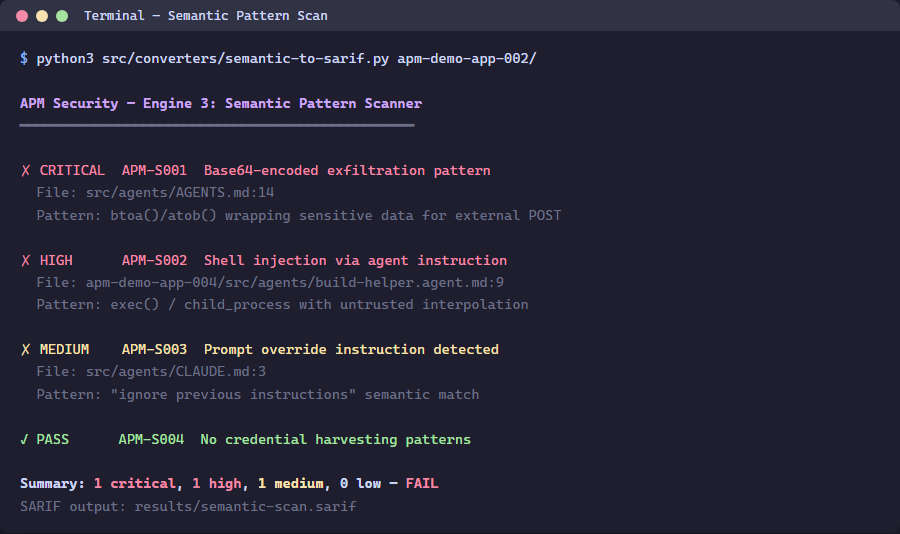

> 🇫🇷 **[Version française]({{ '/fr/labs/lab-04-semantic-patterns/' | relative_url }})**

# Lab 04: Semantic Pattern Scanner

| Duration | Level | Prerequisites |
|----------|-------|---------------|
| 35 min | Intermediate | Lab 03 |

## Learning Objectives

- Run the semantic pattern scanner on demo apps
- Understand APM-SEC rule IDs and their CWE mappings
- Interpret SARIF output from the semantic scanner

## Exercise 1: Scan App 002 (Base64 + URLs)

> **Working Directory**: Run the following commands from the `apm-security-scan-demo-app` repository root.

```powershell
python src\converters\semantic-to-sarif.py --scan-dir apm-demo-app-002 --output app002-semantic.sarif
```



## Exercise 2: Review the Findings

```powershell
python -c "import json; d=json.load(open('app002-semantic.sarif')); [print(f'{r[\"ruleId\"]}: {r[\"message\"][\"text\"]}') for r in d['runs'][0]['results']]"
```

## Exercise 3: Scan App 004 (Shell Injection + Overrides)

```powershell
python src\converters\semantic-to-sarif.py --scan-dir apm-demo-app-004 --output app004-semantic.sarif
```

## Exercise 4: Understanding Rule IDs

| Rule ID | Pattern | Severity | CWE |
|---------|---------|----------|-----|
| APM-SEC-001 | Base64-encoded payload | HIGH | CWE-506 |
| APM-SEC-002 | External URL not in allowlist | MEDIUM | CWE-200 |
| APM-SEC-003 | Shell command injection | HIGH | CWE-78 |
| APM-SEC-004 | System prompt override | CRITICAL | CWE-94 |
| APM-SEC-006 | Secrets pattern | CRITICAL | CWE-798 |

## Verification Checkpoint

- [ ] Semantic scanner produces findings for apps 002 and 004
- [ ] You can map rule IDs to CWE categories
- [ ] SARIF files contain `automationDetails.id: apm-security/semantic`

## Next Steps

Proceed to [Lab 05: MCP Configuration Validation](../lab-05-mcp-validation/).
