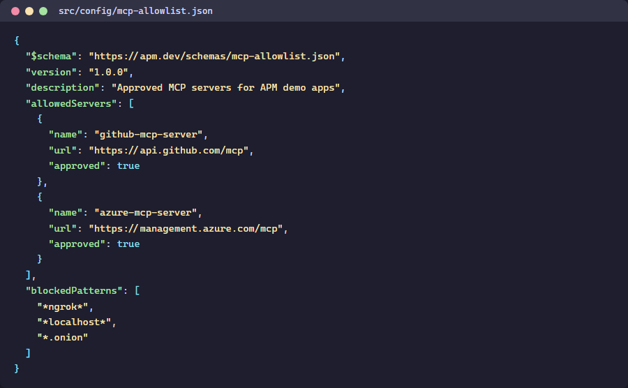
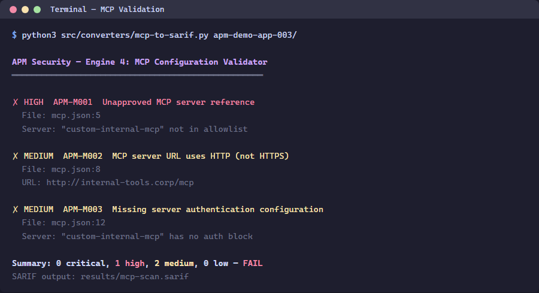

> 🇫🇷 **[Version française]({{ '/fr/labs/lab-05-mcp-validation/' | relative_url }})**

# Lab 05: MCP Configuration Validation

| Duration | Level | Prerequisites |
|----------|-------|---------------|
| 30 min | Intermediate | Lab 04 |

## Learning Objectives

- Run the MCP configuration validator on demo apps
- Understand server allowlists and transport security requirements
- Detect overly broad tool permissions

## Exercise 1: Review the MCP Allowlist

> **Working Directory**: Run the following commands from the `apm-security-scan-demo-app` repository root.

```powershell
Get-Content src\config\mcp-allowlist.json | python -m json.tool
```



## Exercise 2: Scan App 003 (MCP Violations)

```powershell
python src\converters\mcp-to-sarif.py --scan-dir apm-demo-app-003 --output app003-mcp.sarif
```



## Exercise 3: Review Findings

```powershell
python -c "import json; d=json.load(open('app003-mcp.sarif')); [print(f'{r[\"ruleId\"]}: {r[\"message\"][\"text\"]}') for r in d['runs'][0]['results']]"
```

## Exercise 4: Fix a Violation

Edit `apm-demo-app-003\mcp.json` to remove the `rogue-data-server` entry, then re-scan:

```powershell
python src\converters\mcp-to-sarif.py --scan-dir apm-demo-app-003 --output app003-mcp-fixed.sarif
```

Verify the finding count decreased.

## Verification Checkpoint

- [ ] MCP validator produces findings for app 003
- [ ] You understand server allowlists and transport security
- [ ] Removing a rogue server reduces the finding count

## Next Steps

Proceed to [Lab 06: GitHub Security Tab](../lab-06-github-security-tab/) or [Lab 06 ADO](../lab-06-ado-advanced-security/).
