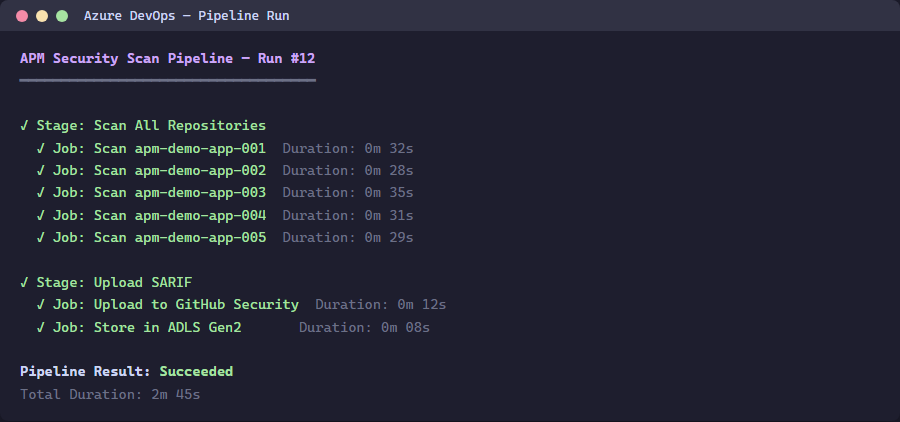
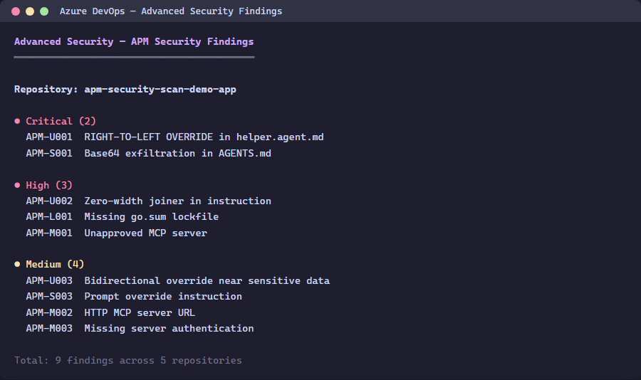

> 🇫🇷 **[Version française](/fr/labs/lab-06-ado-advanced-security)**

# Lab 06 ADO: Advanced Security — SARIF Upload

| Duration | Level | Prerequisites |
|----------|-------|---------------|
| 35 min | Intermediate | Lab 05 |

## Learning Objectives

- Upload SARIF files using `AdvancedSecurity-Publish@1`
- Navigate findings in ADO Advanced Security
- Compare GitHub and ADO SARIF upload workflows

## Exercise 1: Run the ADO Scan Pipeline

Navigate to the ADO project and run the `apm-security-scan` pipeline.

## Exercise 2: View Advanced Security Findings

Navigate to **Repos > Advanced Security** in your ADO project.

## Exercise 3: Compare with GitHub

Note the differences:

| Feature | GitHub | ADO |
|---------|--------|-----|
| Upload task | `github/codeql-action/upload-sarif@v3` | `AdvancedSecurity-Publish@1` |
| Cross-repo | `gh api` with encoded SARIF | Pipeline per repo |
| Navigation | Security > Code scanning | Repos > Advanced Security |

## Verification Checkpoint

- [ ] ADO pipeline runs successfully
- [ ] SARIF findings appear in Advanced Security
- [ ] You can explain the difference between GitHub and ADO SARIF upload

## Next Steps

Proceed to [Lab 07 ADO: Pipelines](../lab-07-ado-pipelines/).
