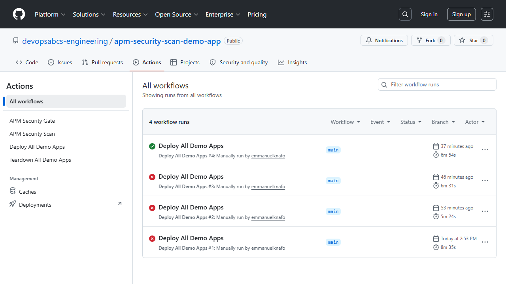
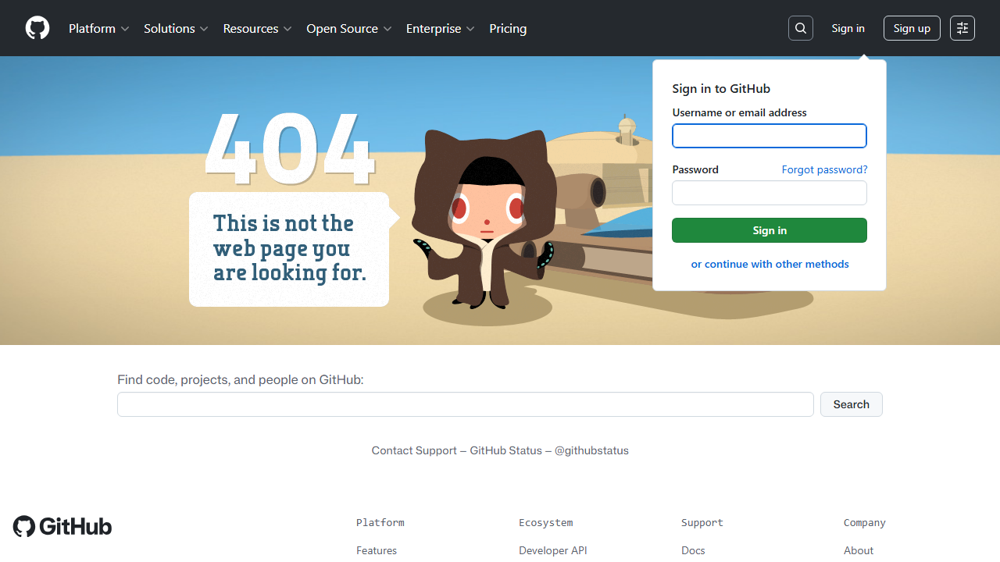

> 🇫🇷 **[Version française](/fr/labs/lab-06-github-security-tab)**

# Lab 06: GitHub Security Tab — SARIF Upload

| Duration | Level | Prerequisites |
|----------|-------|---------------|
| 30 min | Intermediate | Lab 05 |

## Learning Objectives

- Upload SARIF files to GitHub Code Scanning
- Navigate and triage findings in the Security tab
- Understand cross-repo SARIF upload patterns

## Exercise 1: Run the APM Security Scan Workflow

Navigate to the `apm-security-scan-demo-app` repository on GitHub and run the `apm-security-scan.yml` workflow.



## Exercise 2: View Findings in Security Tab

After the workflow completes, visit each demo app's Security > Code scanning tab:

```text
https://github.com/devopsabcs-engineering/apm-demo-app-001/security/code-scanning
```



## Exercise 3: Triage Findings

- Dismiss false positives with a reason
- Open issues for true positives
- Group findings by rule ID

## Verification Checkpoint

- [ ] Workflow completes successfully
- [ ] SARIF findings appear in the Security tab
- [ ] You can triage findings (dismiss/open issue)

## Next Steps

Proceed to [Lab 07: GitHub Actions Pipeline](../lab-07-github-actions/).
