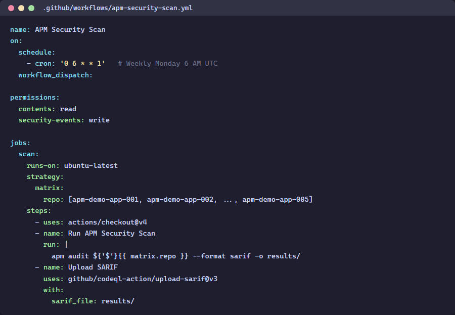

> 🇫🇷 **[Version française](/fr/labs/lab-07-github-actions)**

# Lab 07: GitHub Actions — Multi-Engine Pipeline

| Duration | Level | Prerequisites |
|----------|-------|---------------|
| 45 min | Advanced | Lab 06 |

## Learning Objectives

- Understand the 3-job workflow structure (Unicode, Semantic, MCP)
- Configure PR gating with severity thresholds
- Set up cross-repo SARIF upload with `ORG_ADMIN_TOKEN`

## Exercise 1: Review the Scan Workflow

> **Working Directory**: Run the following commands from the `apm-security-scan-demo-app` repository root.

```powershell
Get-Content .github\workflows\apm-security-scan.yml
```



## Exercise 2: Review the Gate Workflow

```powershell
Get-Content .github\workflows\apm-security-gate.yml
```

## Exercise 3: Create a PR with Violations

Create a branch, add a violation, and open a PR:

```powershell
git checkout -b test/apm-gate
# Add a violation to a file
git add -A
git commit -m "test: add violation to trigger gate"
git push -u origin test/apm-gate
```

Open a PR and observe the gate workflow blocking the merge.

## Verification Checkpoint

- [ ] You understand the 3-job workflow structure
- [ ] The gate workflow blocks PRs with critical findings
- [ ] Cross-repo SARIF upload works via `ORG_ADMIN_TOKEN`

## Next Steps

Proceed to [Lab 08: Power BI Dashboard](../lab-08-dashboard/).
